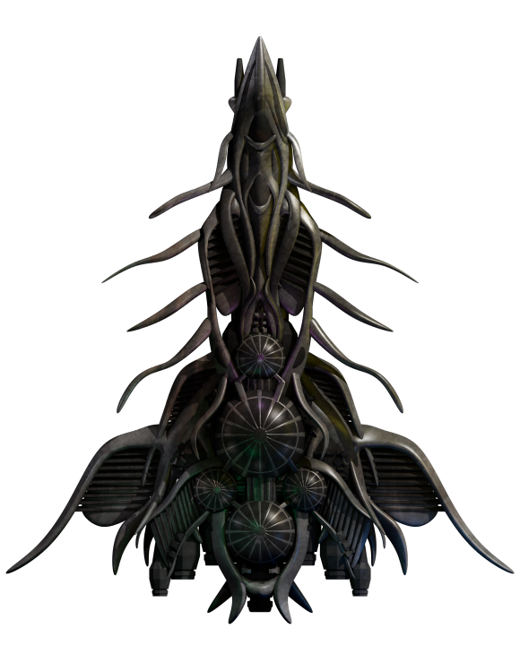

For any suggestions, mistakes, or so, mention me in the games [official discord server^](https://discord.com/invite/ZeuASSx)

https://github.com/Nova1422/plugin-statistics/

[some plugins which are not added here](https://github.com/Nova1422/additional-plugins)
## Latest News:
<table>
<tr>
<td> 
2025-11-25 | update: zoom.extension 
2025-11-24 | update: purchaseable.peregrine 
2025-11-24 | update: purchaseable.androids 
2025-11-24 | update: capture.augen 
2025-11-20 | update: capture.archons 
2025-11-17 | update: modified.pirate.ships 
2025-11-14 | update: capture.archons 
2025-11-14 | update: capturingpower 
2025-11-11 | update: unlock.hai.reveal 
2025-11-04 | update: navypirates 
 
</td>
</tr>
</table>

## Plugin List: 
<table>
<tr valign="top">
<td> 
<a href="README.md#1requiredcrew">1requiredcrew</a> 
<a href="README.md#aberrantkahetoutfitter">aberrant.kahet.outfitter</a> 
<a href="README.md#bunrodeaoutfitter">bunrodeaoutfitter</a> 
<a href="README.md#capturearchons">capture.archons</a> 
<a href="README.md#captureaugen">capture.augen</a> 
<a href="README.md#capturingpower">capturingpower</a> 
 </td><td> 
<a href="README.md#jumpdriveextended">jumpdrive.extended</a> 
<a href="README.md#navypirates">navypirates</a> 
<a href="README.md#obtainheron">obtainheron</a> 
<a href="README.md#purchasebactrian">purchase.bactrian</a> 
<a href="README.md#purchaseableandroids">purchaseable.androids</a> 
<a href="README.md#purchaseablecloakingdevice">purchaseable.cloakingdevice</a> 
 </td><td> 
<a href="README.md#purchaseableperegrine">purchaseable.peregrine</a> 
<a href="README.md#quargoutfitter">quargoutfitter</a> 
<a href="README.md#tributequarg">tributequarg</a> 
<a href="README.md#unlimiteddfc">unlimited.dfc</a> 
<a href="README.md#unlockhaireveal">unlock.hai.reveal</a> 
<a href="README.md#zoomextension">zoom.extension</a> 
 </td></tr></table>

---

### 1requiredcrew

[1requiredcrew.zip](https://github.com/Nova1422/plugins/releases/download/v1.0.0-1requiredcrew/1requiredcrew.zip) | 48.45 kb | 2025-10-19 | [view files](https://github.com/Nova1422/plugins/tree/main/myplugins/1requiredcrew/) <a href="res/imagemd/1requiredcrew.md">view images</a> [1] 
 
>Reduces required crew of non pre existing ships to one. PS- Due to limitations, the ships you already own, will still have their original crew req, and ships you acquire with this plugin enabled, with retain the low crew requirement, ever after the plugin is disabled, best recommended for new saves or for specific captures
>
>Author: Nova.

:blue_book: Plugin readme

<blockquote>N/A</blockquote>

 

---

### aberrant.kahet.outfitter

[aberrant.kahet.outfitter.zip](https://github.com/Nova1422/plugins/releases/download/v1.0.2-aberrant.kahet.outfitter/aberrant.kahet.outfitter.zip) | 96.86 kb | 2025-10-23 | [view files](https://github.com/Nova1422/plugins/tree/main/myplugins/aberrant.kahet.outfitter/) <a href="res/imagemd/aberrant.kahet.outfitter.md">view images</a> [2] 
 
>Sells Kahet and Aberrant Outfits at Remnants and Avgi planets respectively.

:blue_book: Plugin readme

<blockquote>The outfits sold are

Aberrant

"Aberrant Spiker"

"Nucleolysis Beam"

"Telescopic Antimissile"

"Anomalous Shield Restorer"

"Antimatter Power Cell"

"Anomalous Mass"

Kahet

"Ka'het Nullifier"

"Ka'het Ravager Beam"

"Ka'het Ravager Turret"

"Ka'het Annihilator"

"Ka'het Annihilator Turret"

"Annihilator Projectile"

"Ka'het EMP Deployer"

"Ka'het Emergency Deployer"

"Ka'het Support Cooling"

"Ka'het Primary Cooling"

"Ka'het Shield Restorer"

"Ka'het Grand Restorer"

"Ka'het MHD Generator"

"Ka'het Reserve Accumulator"

"Maeri Engine Nacelles"

"Ka'het Sustainer Nacelles"

"Telis Engine Nacelles"

"Vareti Engine Block"

"Ka'het Compact Engine"

"Ka'het Electric Stunner"

changelog

1.0.2 and 1.0.1

nothing, simple repo tweaks
</blockquote>

 

---

### bunrodeaoutfitter

[bunrodeaoutfitter.zip](https://github.com/Nova1422/plugins/releases/download/v1.0.0-bunrodeaoutfitter/bunrodeaoutfitter.zip) | 236.59 kb | 2025-10-22 | [view files](https://github.com/Nova1422/plugins/tree/main/myplugins/bunrodeaoutfitter/) <a href="res/imagemd/bunrodeaoutfitter.md">view images</a> [2] 
 
>Adds an outfitter on the Bunrodea planet "Kalbai"

:blue_book: Plugin readme

<blockquote>N/A</blockquote>

 

---

### capture.archons

[capture.archons.zip](https://github.com/Nova1422/plugins/releases/download/v1.1.1-capture.archons/capture.archons.zip) | 50.35 kb | 2025-11-20 | [view files](https://github.com/Nova1422/plugins/tree/main/myplugins/capture.archons/) <a href="res/imagemd/capture.archons.md">view images</a> [1] 
 
>Allows you to capture Archons.

:blue_book: Plugin readme

<blockquote>Lets you capture pre existing Archon ships, Also spawns capturable Archon ships in the system "Hallownest" near the hai system every 10 minutes, PS- capturing the Archons will not be any easier

Changelog

v1.1.1

updated the README, also fixed the bugs in 1.1.0, in case you had that version, updating the plugin will fix it, fixed by patch.txt

credits to GrayCubeT for pointing that bug out

v1.1.0

Removed any limitations

v1.0.4

Added a new system instead

v1.0.3

Apprantly its Capturable not captureable, added plugin.txt and removed some bloat
</blockquote>

 
screenshots(click to enlarge): 
<table>
	<tr>
		<td></td>
		<td></td>
		<td></td>
	</tr>
</table>
 

 

---

### capture.augen

[capture.augen.zip](https://github.com/Nova1422/plugins/releases/download/v1.0.0-capture.augen/capture.augen.zip) | 73.02 kb | 2025-11-24 | [view files](https://github.com/Nova1422/plugins/tree/main/myplugins/capture.augen/) <a href="res/imagemd/capture.augen.md">view images</a> [1] 
 
>Lets you capture the gegno ship "Augen" without consequences.

:blue_book: Plugin readme

<blockquote>N/A</blockquote>

 

---

### capturingpower

[capturingpower.zip](https://github.com/Nova1422/plugins/releases/download/v1.0.1-capturingpower/capturingpower.zip) | 86.87 kb | 2025-11-14 | [view files](https://github.com/Nova1422/plugins/tree/main/myplugins/capturingpower/) <a href="res/imagemd/capturingpower.md">view images</a> [5] 
 
>adds two purchasable h2h with 100k attack and defense each, on the planet "Pugglemug"

:blue_book: Plugin readme

<blockquote>changelog

1.0.1

ironically was made because readme.md was removed, added plugin.txt
</blockquote>

 
screenshots(click to enlarge): 
<table>
	<tr>
		<td></td>
		<td></td>
	</tr>
</table>
 

 

---

### jumpdrive.extended

[jumpdrive.extended.zip](https://github.com/Nova1422/plugins/releases/download/v1.0.1-jumpdrive.extended/jumpdrive.extended.zip) | 719.9 kb | 2025-10-22 | [view files](https://github.com/Nova1422/plugins/tree/main/myplugins/jumpdrive.extended/) <a href="res/imagemd/jumpdrive.extended.md">view images</a> [6] 
 
>Sells the jump drive and some custom variants at the planet Caeliana

:blue_book: Plugin readme

<blockquote>Sells the jump drive and a couple upgraded variants at planet Caeliana

Variants-

Vortex Drive: "A strange, ominous, blue-tinted version of the jump drive. More mysterious, more potent, and unlike anything known before. Origin  unknown, Behaviour erratic, Performance unmatched"

Range- 5x

Carrion Drive: "Legends say this thing willed itself into existence."

Range- Enough

Changelog

v1.0.1

Added plugin.txt and renamed point drives to vortex and carrion drive, also buffed the red drive tenfold

</blockquote>

 
screenshots(click to enlarge): 
<table>
	<tr>
		<td></td>
	</tr>
</table>
 

 

---

### navypirates

[navypirates.zip](https://github.com/Nova1422/plugins/releases/download/v1.0.0-navypirates/navypirates.zip) | 321.84 kb | 2025-11-04 | [view files](https://github.com/Nova1422/plugins/tree/main/myplugins/navypirates/) <a href="res/imagemd/navypirates.md">view images</a> [2] 
 
>Adds Navy ships into pirate fleets.

:blue_book: Plugin readme

<blockquote>N/A</blockquote>

 

---

### obtainheron

[obtainheron.zip](https://github.com/Nova1422/plugins/releases/download/v1.0.4-obtainheron/obtainheron.zip) | 101.21 kb | 2025-11-04 | [view files](https://github.com/Nova1422/plugins/tree/main/myplugins/obtainheron/) <a href="res/imagemd/obtainheron.md">view images</a> [1] 
 
>Obtain the Superheavy Remnant ship, Heron, through a job board mission offered by any of the remnant planets.

:blue_book: Plugin readme

<blockquote>changelog

v1.0.4

changed the icon

v1.0.3

you also get 32 drones and 3 fighters alongside heron now, Which should been like this from the start

also fixed icon@2x, which was previously named heron@2x

</blockquote>

 

---

### purchase.bactrian

[purchase.bactrian.zip](https://github.com/Nova1422/plugins/releases/download/v1.0.1-purchase.bactrian/purchase.bactrian.zip) | 375.52 kb | 2025-10-25 | [view files](https://github.com/Nova1422/plugins/tree/main/myplugins/purchase.bactrian/) <a href="res/imagemd/purchase.bactrian.md">view images</a> [2] 
 
>Sells a license-free bactrian in the northern pirate planet "Haven"

:blue_book: Plugin readme

<blockquote>N/A</blockquote>

 
screenshots(click to enlarge): 
<table>
	<tr>
		<td></td>
	</tr>
</table>
 

 

---

### purchaseable.androids

[purchaseable.androids.zip](https://github.com/Nova1422/plugins/releases/download/v1.0.0-purchaseable.androids/purchaseable.androids.zip) | 18.13 kb | 2025-11-24 | [view files](https://github.com/Nova1422/plugins/tree/main/myplugins/purchaseable.androids/) <a href="res/imagemd/purchaseable.androids.md">view images</a> [1] 
 
>Lets you purchase the functional unique "NDR-114 Android", on any remnant planet.

:blue_book: Plugin readme

<blockquote>N/A</blockquote>

 

---

### purchaseable.cloakingdevice

[purchaseable.cloakingdevice.zip](https://github.com/Nova1422/plugins/releases/download/v1.0.0-purchaseable.cloakingdevice/purchaseable.cloakingdevice.zip) | 4.66 kb | 2025-10-18 | [view files](https://github.com/Nova1422/plugins/tree/main/myplugins/purchaseable.cloakingdevice/) <a href="res/imagemd/purchaseable.cloakingdevice.md">view images</a> [1] 
 
>Sells Cloaking Devices on the syndicate planet "Hephaestus"
>
>
>Author: Nova.

:blue_book: Plugin readme

<blockquote>N/A</blockquote>

 
screenshots(click to enlarge): 
<table>
	<tr>
		<td></td>
		<td></td>
	</tr>
</table>
 

 

---

### purchaseable.peregrine

[purchaseable.peregrine.zip](https://github.com/Nova1422/plugins/releases/download/v1.0.0-purchaseable.peregrine/purchaseable.peregrine.zip) | 38.51 kb | 2025-11-24 | [view files](https://github.com/Nova1422/plugins/tree/main/myplugins/purchaseable.peregrine/) <a href="res/imagemd/purchaseable.peregrine.md">view images</a> [1] 
 
>Makes Peregrine available for sale.

:blue_book: Plugin readme

<blockquote>N/A</blockquote>

 

---

### quargoutfitter

[quargoutfitter.zip](https://github.com/Nova1422/plugins/releases/download/v1.0.0-quargoutfitter/quargoutfitter.zip) | 105.86 kb | 2025-10-24 | [view files](https://github.com/Nova1422/plugins/tree/main/myplugins/quargoutfitter/) <a href="res/imagemd/quargoutfitter.md">view images</a> [2] 
 
>Allows Purchase of Quarg Outfits on specific planets.
>The Planets are, "Smuggler's Den", and  "Ring of Power"/"Remote Blue", Depending on which side you chose in coalition space
>Also removes Quarg Death Sentence.

:blue_book: Plugin readme

<blockquote>N/A</blockquote>

 
screenshots(click to enlarge): 
<table>
	<tr>
		<td></td>
	</tr>
</table>
 

 

---

### tributequarg

[tributequarg.zip](https://github.com/Nova1422/plugins/releases/download/v1.0.2-tributequarg/tributequarg.zip) | 42.92 kb | 2025-10-22 | [view files](https://github.com/Nova1422/plugins/tree/main/myplugins/tributequarg/) <a href="res/imagemd/tributequarg.md">view images</a> [2] 
 
>Lets you tribute Quarg planets and ringworlds

:blue_book: Plugin readme

<blockquote>^Rightful credits to Zuckung for their major help in this plugin

changelog

v1.0.2

fixed the mission
</blockquote>

 
screenshots(click to enlarge): 
<table>
	<tr>
		<td></td>
	</tr>
</table>
 

 

---

### unlimited.dfc

[unlimited.dfc.zip](https://github.com/Nova1422/plugins/releases/download/v1.0.0-unlimited.dfc/unlimited.dfc.zip) | 100.79 kb | 2025-10-18 | [view files](https://github.com/Nova1422/plugins/tree/main/myplugins/unlimited.dfc/) <a href="res/imagemd/unlimited.dfc.md">view images</a> [2] 
 
>Lets you fire Dragonflame Cannon indefinitely by reducing firing fuel and heat to 0
>
>
>Author: Nova.

:blue_book: Plugin readme

<blockquote>reduces its firing energy, fuel, heat, and force to 0, while increasing fire rate sixfold
</blockquote>

 
screenshots(click to enlarge): 
<table>
	<tr>
		<td></td>
	</tr>
</table>
 

 

---

### unlock.hai.reveal

[unlock.hai.reveal.zip](https://github.com/Nova1422/plugins/releases/download/v1.0.0-unlock.hai.reveal/unlock.hai.reveal.zip) | 39.27 kb | 2025-11-11 | [view files](https://github.com/Nova1422/plugins/tree/main/myplugins/unlock.hai.reveal/) <a href="res/imagemd/unlock.hai.reveal.md">view images</a> [1] 
 
>Re-enables the blocked Hai Reveal storyline

:blue_book: Plugin readme

<blockquote>In 0.10.0 HR was disabled, and restricted to just the intro, in 0.10.1, Two starting missions for HR, that is, Hai Leaks Response 1 and 2, were removed, That meant HR could no longer be triggered any more

this plugin adds Hai Leaks Response 1 and 2, and re enables the disabled mission, letting you play the HR line

Rightful credits to SomeTroglodyte and everyone involved in discussion #9161 for providing me the framework to understand and make this plugin

repair hai reveal.txt(and the icon.png) was originally made by SomeTroglodyte for version 0.10.2, it was highly edited by me, which involved deleting the pre existing missions, and updating the added mission as per the latest release

the fix was, as they stated, incomplete, that is, the condition "Hai Leaks Response 2: done" was impossible to get, this was fixed by me in tweaks.txt
</blockquote>

 

---

### zoom.extension

[zoom.extension.zip](https://github.com/Nova1422/plugins/releases/download/v1.0.1-zoom.extension/zoom.extension.zip) | 4.54 kb | 2025-11-25 | [view files](https://github.com/Nova1422/plugins/tree/main/myplugins/zoom.extension/) <a href="res/imagemd/zoom.extension.md">view images</a> [1] 
 
>Lets you zoom out more.

:blue_book: Plugin readme

<blockquote>N/A</blockquote>

 
